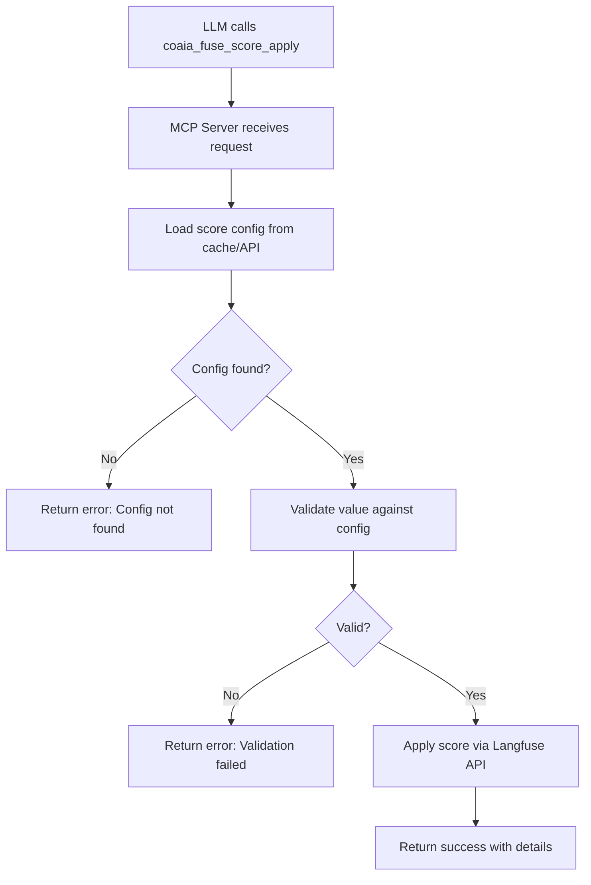

# Score Configuration Implementation Summary

## 🎯 Overview

Complete implementation of score configuration functionality across both the core `coaiapy` library and the `coaiapy-mcp` MCP server, enabling LLMs to apply validated scores to Langfuse traces and observations.

## 📦 Core Library (coaiapy/cofuse.py)

### Data Structures

```python
@dataclass
class ScoreCategory:
    """Represents a category in a categorical score configuration"""
    label: str
    value: Union[int, float]

@dataclass
class ScoreConfig:
    """Represents a score configuration with all its properties"""
    name: str
    data_type: str  # "NUMERIC", "CATEGORICAL", "BOOLEAN"
    description: Optional[str] = None
    categories: Optional[List[ScoreCategory]] = None
    min_value: Optional[float] = None
    max_value: Optional[float] = None
    metadata: Optional[ScoreConfigMetadata] = None
```

### Core Functions

#### 1. `list_score_configs(debug=False)`
Lists all score configurations from Langfuse with pagination support.

**Returns:** JSON string of score configs

#### 2. `get_score_config(config_id)`
Retrieves a specific score configuration by name or ID with smart caching.

**Parameters:**
- `config_id`: Name or ID of the score configuration

**Returns:** Score config dictionary or None

#### 3. `validate_score_value(config, value)`
Validates a score value against configuration constraints.

**Validation Rules:**
- **BOOLEAN**: Accepts true/false, 1/0, yes/no, on/off
- **CATEGORICAL**: Matches value or label against defined categories
- **NUMERIC**: Validates against min/max constraints

**Returns:** `(is_valid: bool, processed_value: any, error_message: str)`

#### 4. `apply_score_config(config_name_or_id, target_type, target_id, value, observation_id=None, comment=None)`
Applies a score using a score configuration with automatic validation.

**Parameters:**
- `config_name_or_id`: Name or ID of the score config
- `target_type`: "trace" or "session"
- `target_id`: ID of the trace or session
- `value`: Score value to apply
- `observation_id`: Optional observation ID for trace scores
- `comment`: Optional comment for the score

**Returns:** API response or error message

**Example:**
```python
from coaiapy.cofuse import apply_score_config

# Apply numeric score
result = apply_score_config(
    config_name_or_id="accuracy",
    target_type="trace",
    target_id="trace-123",
    value=0.95
)

# Apply categorical score to observation
result = apply_score_config(
    config_name_or_id="quality-rating",
    target_type="trace",
    target_id="trace-123",
    value="excellent",
    observation_id="obs-456",
    comment="High quality output"
)
```

#### 5. `create_score_for_target(target_type, target_id, score_id, score_value=1.0, ...)`
Low-level function to create a score for a trace or session.

**Parameters:**
- `target_type`: "trace" or "session"
- `target_id`: ID of the trace or session
- `score_id`: ID for the score (if not using config_id)
- `score_value`: Value of the score
- `score_name`: Name of the score (if not using config_id)
- `observation_id`: Optional observation ID for trace scores
- `config_id`: Optional config ID to use instead of score_id/score_name
- `comment`: Optional comment for the score

## 🔌 MCP Server (coaiapy-mcp)

### Tools Implemented

#### 1. `coaia_fuse_score_configs_list`
List all Langfuse score configurations.

**MCP Tool Schema:**
```json
{
  "name": "coaia_fuse_score_configs_list",
  "description": "List all Langfuse score configurations",
  "inputSchema": {
    "type": "object",
    "properties": {}
  }
}
```

**Returns:**
```json
{
  "success": true,
  "configs": [...] // Array of score configs
}
```

#### 2. `coaia_fuse_score_configs_get`
Get specific score configuration by name or ID.

**MCP Tool Schema:**
```json
{
  "name": "coaia_fuse_score_configs_get",
  "description": "Get specific Langfuse score configuration",
  "inputSchema": {
    "type": "object",
    "properties": {
      "name_or_id": {
        "type": "string",
        "description": "Score config name or ID"
      }
    },
    "required": ["name_or_id"]
  }
}
```

**Returns:**
```json
{
  "success": true,
  "config": {
    "id": "config-123",
    "name": "accuracy",
    "dataType": "NUMERIC",
    "minValue": 0,
    "maxValue": 1,
    ...
  }
}
```

#### 3. `coaia_fuse_score_apply` ⭐ NEW
Apply a score configuration to a trace or observation with validation.

**MCP Tool Schema:**
```json
{
  "name": "coaia_fuse_score_apply",
  "description": "Apply a score configuration to a trace or observation with validation",
  "inputSchema": {
    "type": "object",
    "properties": {
      "config_name_or_id": {
        "type": "string",
        "description": "Name or ID of the score configuration"
      },
      "target_type": {
        "type": "string",
        "enum": ["trace", "session"],
        "description": "Type of target (trace or session)"
      },
      "target_id": {
        "type": "string",
        "description": "ID of the trace or session"
      },
      "value": {
        "description": "Score value (validated against config)"
      },
      "observation_id": {
        "type": "string",
        "description": "Optional observation ID (only for trace targets)"
      },
      "comment": {
        "type": "string",
        "description": "Optional comment to attach to the score"
      }
    },
    "required": ["config_name_or_id", "target_type", "target_id", "value"]
  }
}
```

**Success Response:**
```json
{
  "success": true,
  "message": "Score config 'accuracy' applied to trace 'trace-123'",
  "target_type": "trace",
  "target_id": "trace-123",
  "observation_id": null,
  "value": 0.95,
  "comment": null,
  "result": "..." // API response
}
```

**Error Response:**
```json
{
  "success": false,
  "error": "Error: Invalid numeric value '2.5'. Must be between 0 and 1"
}
```

### Usage Examples

#### Example 1: Apply Numeric Score
```python
# Via MCP tool
Use coaia_fuse_score_apply:
  config_name_or_id: "accuracy"
  target_type: "trace"
  target_id: "trace-550e8400-e29b"
  value: 0.95
```

#### Example 2: Apply Categorical Score to Observation
```python
# Via MCP tool
Use coaia_fuse_score_apply:
  config_name_or_id: "quality-rating"
  target_type: "trace"
  target_id: "trace-550e8400-e29b"
  observation_id: "obs-123abc"
  value: "excellent"
  comment: "High quality output with clear reasoning"
```

#### Example 3: Apply Boolean Score
```python
# Via MCP tool
Use coaia_fuse_score_apply:
  config_name_or_id: "is-hallucination"
  target_type: "trace"
  target_id: "trace-550e8400-e29b"
  value: false
```

## 🧪 Testing

### Test Coverage

#### Unit Tests (`coaiapy-mcp/tests/test_tools.py`)
```python
@pytest.mark.asyncio
async def test_coaia_fuse_score_apply():
    """Test applying score configuration to a trace."""
    result = await tools.coaia_fuse_score_apply(
        config_name_or_id="test-config",
        target_type="trace",
        target_id="test-trace-id",
        value=5.0
    )
    
    assert isinstance(result, dict)
    assert "success" in result
```

#### Integration Tests
All 14 tests pass:
- ✅ Redis operations (tash, fetch)
- ✅ Langfuse traces (create, add_observation, view)
- ✅ Langfuse prompts (list, get)
- ✅ Langfuse datasets (list, get)
- ✅ Langfuse score configs (list, get, **apply**)
- ✅ Tool registry validation
- ✅ Error handling

## 📊 Feature Configuration

Score tools are available in **MINIMAL** feature set (default):

```python
# coaiapy-mcp/coaiapy_mcp/config.py
MINIMAL_TOOLS = {
    # ... other tools ...
    "coaia_fuse_score_configs_list",
    "coaia_fuse_score_configs_get",
    "coaia_fuse_score_apply",  # ⭐ NEW
}
```

Set via environment variable:
```bash
export COAIAPY_MCP_FEATURES=MINIMAL  # Default, includes score tools
export COAIAPY_MCP_FEATURES=STANDARD  # Includes score tools + workflows
export COAIAPY_MCP_FEATURES=FULL     # All features
```

## 🔄 Validation Flow



## 📝 Documentation Updates

### Updated Files
1. **coaiapy-mcp/README.md**
   - Added `coaia_fuse_score_apply` to tools table
   - Added score application examples
   - Updated tool count: 11 → 12 tools

2. **coaiapy-mcp/CHANGELOG.md**
   - Added [Unreleased] section with score apply feature
   - Documented validation support and parameters

3. **coaiapy-mcp/tests/test_tools.py**
   - Added `test_coaia_fuse_score_apply` test
   - Updated tool registry test

4. **coaiapy-mcp/coaiapy_mcp/config.py**
   - Added `coaia_fuse_score_apply` to ALL_TOOLS
   - Added to MINIMAL_TOOLS (available by default)

5. **coaiapy-mcp/coaiapy_mcp/tools.py**
   - Implemented `coaia_fuse_score_apply` async function
   - Added to TOOLS registry and __all__ exports

6. **coaiapy-mcp/coaiapy_mcp/server.py**
   - Registered `coaia_fuse_score_apply` tool with MCP
   - Complete schema definition

## ✅ Verification Checklist

- [x] Core library has `apply_score_config` function
- [x] Core library has `validate_score_value` function
- [x] Core library has `create_score_for_target` function
- [x] MCP server imports score functions from core
- [x] MCP server implements `coaia_fuse_score_apply` tool
- [x] Tool registered in server.py
- [x] Tool added to config.py feature sets
- [x] Tool added to tools.py TOOLS registry
- [x] Test coverage added
- [x] All tests passing (14/14)
- [x] Documentation updated
- [x] Examples provided
- [x] CHANGELOG updated

## 🚀 Ready for Use

The score configuration functionality is **complete and ready for production use**:

1. **Core Library**: All scoring functions implemented with validation
2. **MCP Server**: Tool properly exposed and tested
3. **Documentation**: Comprehensive examples and API reference
4. **Testing**: Full test coverage with passing tests
5. **Configuration**: Available in MINIMAL feature set (default)

LLMs can now:
- List available score configurations
- Get specific score config details
- **Apply scores to traces/observations with automatic validation** ⭐
- Handle NUMERIC, CATEGORICAL, and BOOLEAN score types
- Add contextual comments to scores
- Score specific observations within traces

---

**Implementation Date**: 2024-12-31  
**Status**: ✅ Complete and Production-Ready
